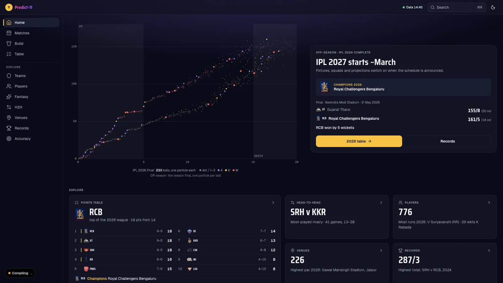
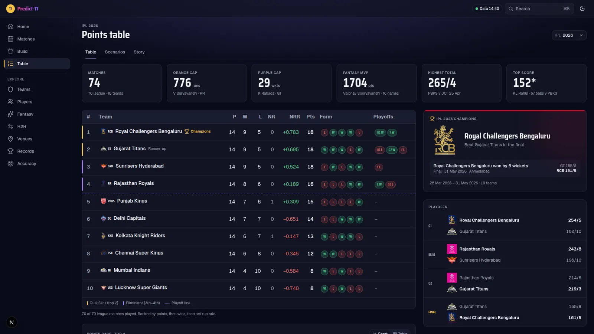
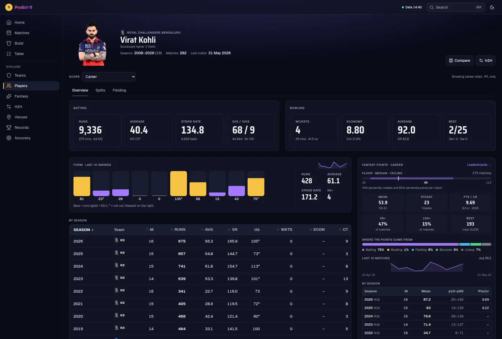
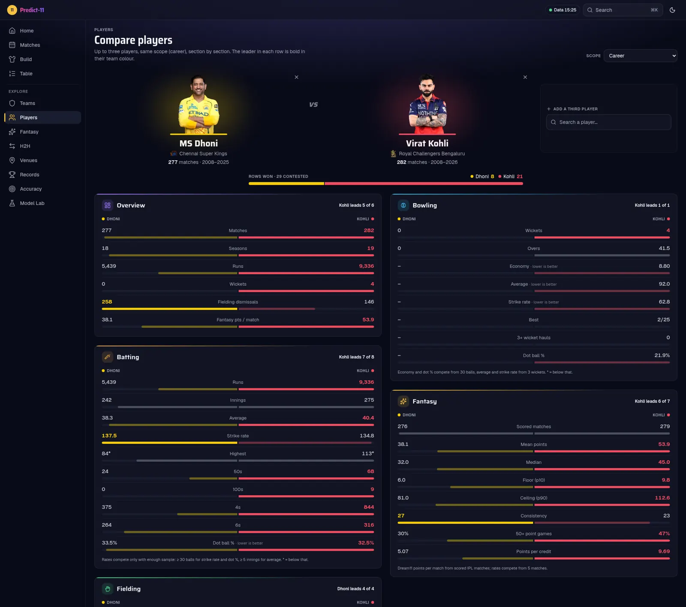
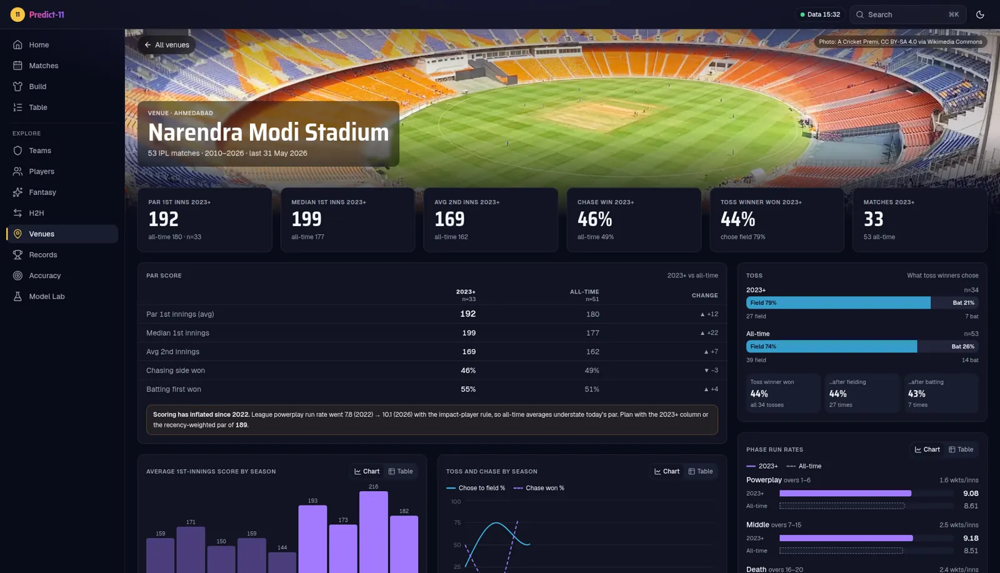

# Predict-11 🏏

**IPL analytics and a machine-learning Dream11 fantasy-points model**: 19 seasons of
ball-by-ball data (2008–2026), a LightGBM model that predicts every player's fantasy points
(with a floor–ceiling range) at the toss, an exact team optimiser, and a **Model Lab** that
explains how the model was trained and how good it really is.

**Live:** website **https://predict11-olive.vercel.app** · API `https://predict11-api.onrender.com/docs`
(free tier: the first request after ~15 idle minutes takes about a minute to wake the API)



## What's inside

| Area | What you get |
|---|---|
| **Points table** | Every season 2008–2026, official NRR / tie-breaks, playoff results, champion card, season leaders, points race, playoff **scenarios** and the season **story** |
| **Teams** | Franchise history, season-by-season finishes, squad (latest roster), matches, team v team |
| **Players** | Full profiles (batting, bowling, fielding, phase splits, pace v spin, v batting hand), fantasy range, form; **Compare** up to 3 players with split bars, skill radar and season charts |
| **H2H** | Batter v bowler face-off with sample-size confidence, dismissal types, by season |
| **Venues** | Stadium photos, par scores (2023+ impact-player era vs all-time), toss and chase trends, phase run rates, pace v spin, dew & weather |
| **Fantasy** | Dream11 points for every match since 2008 (validated 40/40 against published 2026 totals), leaderboards, consistency, hindsight best XIs, team of the season |
| **Predictions** | The model's XI for every 2026 match, made **before** the match from earlier data only, vs a last-5-form baseline and the best possible XI |
| **Build** | Pitch-view team builder on the model's predictions: lock / exclude, re-optimise under Dream11 rules |
| **Model Lab** | The whole training story for learning ML: data, 92 features, learning curves, tuning, evaluation with confidence intervals, calibration, residuals, SHAP explanations, run comparison and a glossary |

| | |
|---|---|
|  |  |
|  |  |

## The model

Predicts each player's Dream11 points **at the toss** (playing XIs, venue, toss and weather
known; everything else from earlier matches only).

- **Features (92, point-in-time):** form windows and EWM, batting / bowling / fielding craft and
  phase usage, matchups against the announced opposition XI (pace/spin share, left-hander share),
  venue and opponent history, team context, venue par, toss, dew and weather, era.
- **Model:** LightGBM — a mean head (squared error) plus p10 / p50 / p90 quantile heads;
  ~270 trees, 16k learned values. Recency-weighted.
- **Optimiser:** exact ILP (HiGHS) for the best legal XI with captain ×2 / vice-captain ×1.5.
- **Evaluation:** rolling-origin CV over 2020–2024 for tuning, 2025 held out and scored once, then a
  2026 walk-forward (retrained every 10 matches, like live use). Paired bootstrap 95% CIs vs a
  "mean of the last 5 games" baseline. A leakage test guards the point-in-time features.

| vs last-5 baseline | 2025 test (frozen) | 2026 walk-forward (retrained) |
|---|---|---|
| Best-XI points / match | 759 vs 751 (n.s.) | **831 vs 755** (+76, CI +39…+115) |
| Captain in top 2 | 21% vs 17% (n.s.) | **27% vs 7%** |
| MAE per player | **33.6 vs 35.9** | **35.5 vs 38.5** |

Fantasy points are mostly noise (the model explains ~5% of variance), so the edge comes from
many small advantages and is largest when the model is retrained in-season. Full write-up:
[docs/MODEL-REPORT.md](docs/MODEL-REPORT.md), and interactively in the Model Lab.

## Architecture

```
Cricsheet (2008–26) ─┐                                    ┌─► Next.js 16 web (Vercel)
stats.bcci.tv ───────┼─► ingest + player registry ─► Postgres (Supabase) ◄─┤
ESPN / Cricbuzz ─────┤      Dream11 scoring, weather,       ▲              └─► FastAPI (Render)
Open-Meteo ──────────┘      photos, credits                 │                    │
                                                            │       analytics, optimiser,
                    features ─► LightGBM (mean + quantiles) ┘       Model Lab, predictions
```

| Layer | Stack |
|---|---|
| Web | Next.js 16 (App Router), React, Tailwind v4, TanStack Query, Recharts, Vitest |
| API | Python 3.12+, FastAPI, SQLAlchemy, Pydantic, pandas, LightGBM, PuLP / HiGHS, uv |
| Data | PostgreSQL 16/17, Alembic migrations |
| Deploy | Vercel (web) · Render free, Docker (API) · Supabase free (Postgres) · GitHub Actions (CI, keep-alive) |

```
backend/   FastAPI app + data pipeline + model (src/p11/{api,analytics,ingest,registry,
           scoring,fantasy,features,model,optimize}), Alembic migrations, tests
web/       Next.js app (src/app routes, src/features/*, shared src/components)
models/    trained model run deployed with the API (models/latest.json → run dir)
data/      raw inputs (squad CSVs with credits, curated photo lists); downloads are git-ignored
docs/      model report, plan, feature catalog, design direction, next queue
infra/     docker-compose for local Postgres, helper scripts
spikes/    early source-scraping experiments
```

## Run it locally

Requirements: Docker, [uv](https://docs.astral.sh/uv/), Node 22+ and pnpm.

```bash
cp .env.example .env
make db-up        # Postgres 16 on :5433
make setup        # backend deps
make migrate      # schema
make api          # API on http://localhost:8000 (docs at /docs)
make web          # web on http://localhost:3000   (cd web && pnpm install first)
make test         # backend tests (integration tests need the loaded database)
```

Loading the data from scratch (`uv run p11 --help` lists everything):

```bash
cd backend
uv run p11 cricsheet download ...       # Cricsheet zips
uv run p11 registry load                # players, ids, aliases
uv run p11 backfill cricsheet ...       # matches + ball-by-ball
uv run p11 fantasy compute              # Dream11 points per player-match
uv run p11 credits load --season 2025   # squad CSVs → credits
uv run p11 attributes load              # roles, batting hand, bowling type, photos
uv run p11 media cache --all            # local photo cache
uv run p11 weather venues ...           # coordinates + match weather
uv run p11 model train                  # ~25 min on 8 cores; writes models/<run>/ + DB rows
```

A snapshot of the database can be restored with `make db-restore FILE=...`.

## Deploy

- **API (Render, free):** `render.yaml` blueprint → Docker image from `backend/Dockerfile`
  (bundles the model run). Set `P11_DATABASE_URL`. Auto-deploys on push to `main`.
- **Web (Vercel, free):** project root `web/`, env `NEXT_PUBLIC_API_URL` = the API URL.
- **Database (Supabase, free):** run Alembic migrations, then restore a dump.
- **Keep-alive:** `.github/workflows/keepalive.yml` pings the API every 2 days (repo variable
  `API_URL`) so the free database doesn't pause.
- Retraining runs locally (or on a GitHub Actions runner), never on the free API host:
  commit the new `models/<run>/` and Render redeploys.

## Data & credits

Ball-by-ball data from [Cricsheet](https://cricsheet.org) (ODC-BY). Player photos and team
crests from the official IPL site; stadium photos from Wikimedia Commons under their CC
licences (credited on each page). Weather from [Open-Meteo](https://open-meteo.com).
Not affiliated with the IPL, BCCI or Dream11; for analysis and learning only.

The previous (v1) version of this project is preserved at the `v1` tag.
